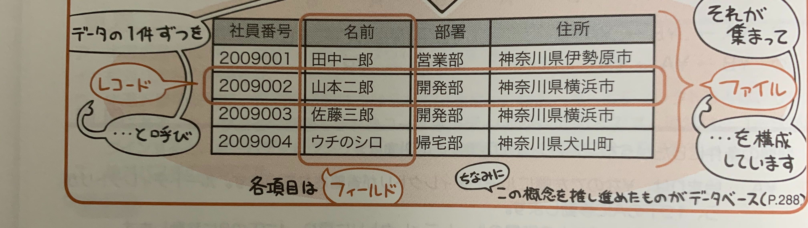

企業の基幹業務などに利用される大型のコンピュータが汎用コンピュータ、メインフレームと呼ばれたりもする。

汎用コンピュータにおけるファイルとは、一連のデータをまとめたもの。
**レコード**の集合がファイル。

## ファイルのアクセス方法

汎用コンピュータにおけるファイルのアクセス方法は次のパターンがある。
- 順次アクセス  
  - 先頭から順にアクセスしていく。  
- 直接アクセス  
  - 直接、任意のレコードにアクセスする。  
- 動的アクセス
  - 上記2つの組み合わせで、直接アクセスをした後、そこから順次アクセスをする

## ファイルの編成法

「どのようにレコードを格納する」かを定義付けた汎用コンピュータにおけるファイルの編成法は次のパターンがある。

### 順編成ファイル

レコードを先頭から順に格納する。  
最も単純な編成法で、順次アクセスのみが可能。

#### 特徴
- 記憶領域に無駄がない
- 一連のデータを大量に処理する用途に向く
- レコードの削除や挿入が苦手

### 直接編成ファイル

レコードの中のキーとなる値を用いて、レコードの格納アドレスを求める編成法。  
- 直接アドレス方式
- 間接アドレス方式

があり、キー値からの格納アドレスの求め方が違う。
直接アクセスが可能。

#### 特徴

- レコードの追加・削除が容易
- 小容量のデータを読み書きするのに向く
- 記憶領域の使用率はあまり良くない

#### 直接アドレス方式

キー値をそのまま格納アドレスとして用いる方式。  
キー値が飛び飛びの場合、使用されない領域がたくさんでる。

#### 間接アドレス方式

ハッシュ関数という計算式により、キー値から格納アドレスを算出する方式。  
ハッシュ関数による計算結果が重複することで、異なるレコードが同じ格納アドレスで衝突してしまうことがある。(**シノニム**)

### 索引編成ファイル

索引を格納する**索引域**と、レコードを格納する**基本データ域**、そこからあふれたレコードを格納する**あふれ域**
の3つの領域から構成され、  
索引による直接アクセスと、先頭からの順次アクセスという両方の特性を兼ね備える。

### 区分編成ファイル

**メンバ**と呼ばれる順編成ファイルを複数もち、それらを格納する**メンバ域**と、各メンバへのアドレスを管理する**ディレクトリ域**とで構成される。