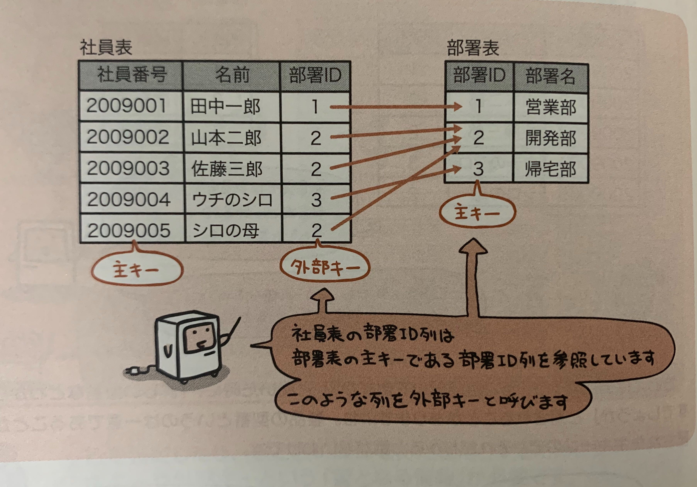

## 主キー

データベースのひょうには必ずひとつひとつの行を識別できるようにキーとなる情報が含まれている。  
これを**主キー**という。
社員番号や学籍番号などがそう。

### 主キーの条件
- 表の中で内容が重複しないこと
- 内容が空でないこと

### 複合キー

ひとつの列だけだと一意にはならないけど、複数の列を組み合わせると一意になる場合、  
このような複数の列を組み合わせて主キーにしたものを**複合キー**という。

## 外部キー

表と表とを関係付けるため、他の表の主キーを参照する列のことを外部キーという。

