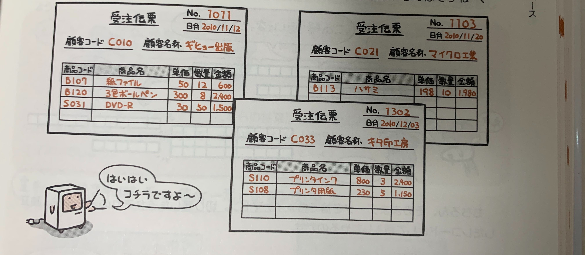
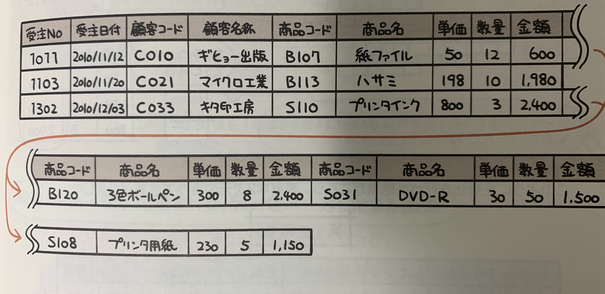
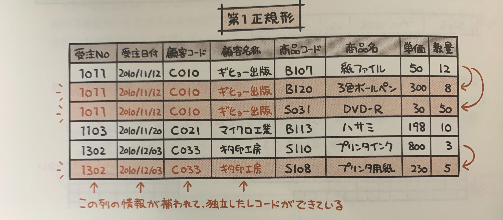
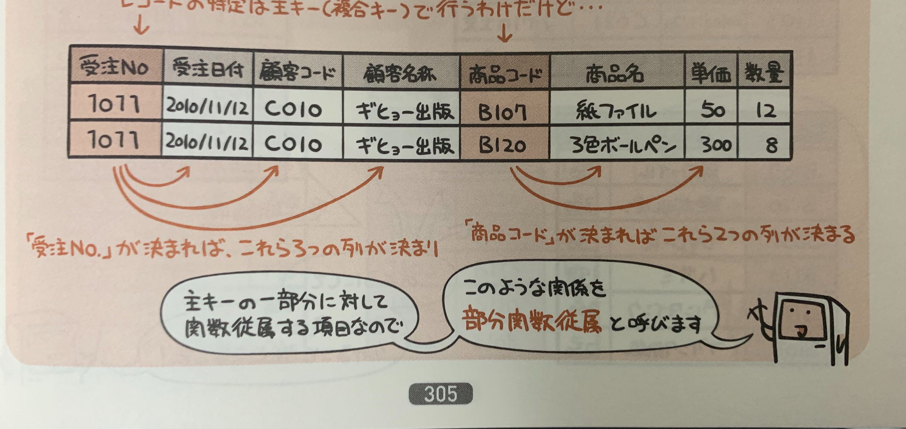
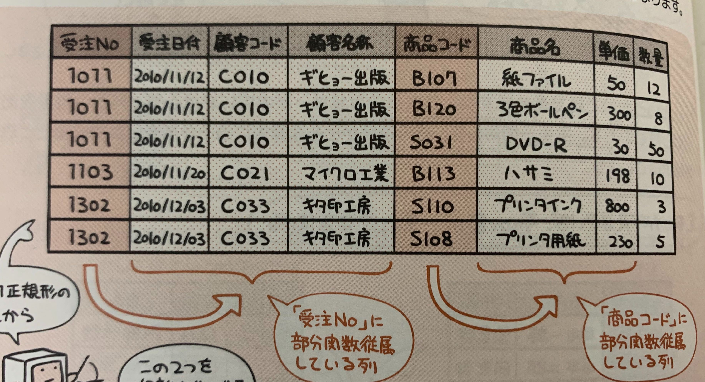
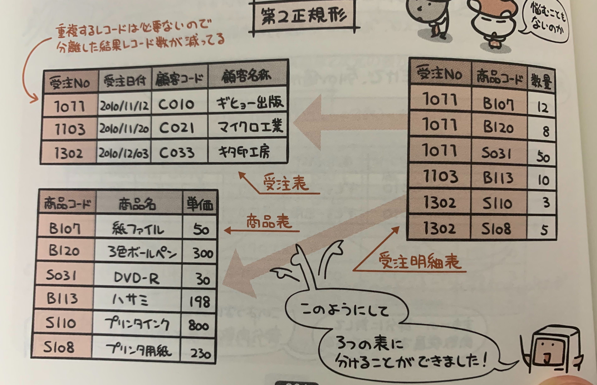
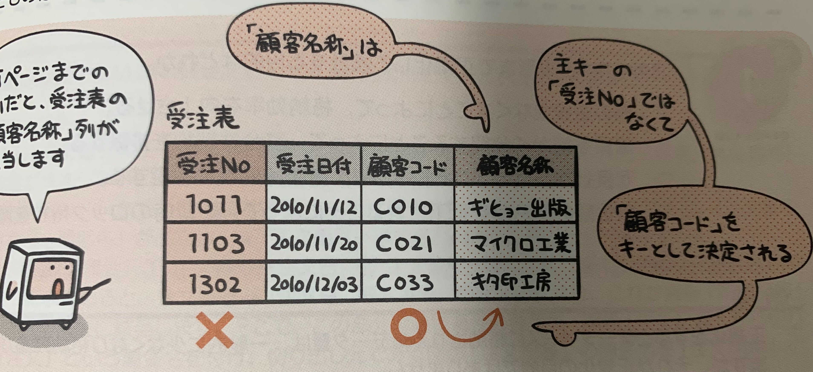
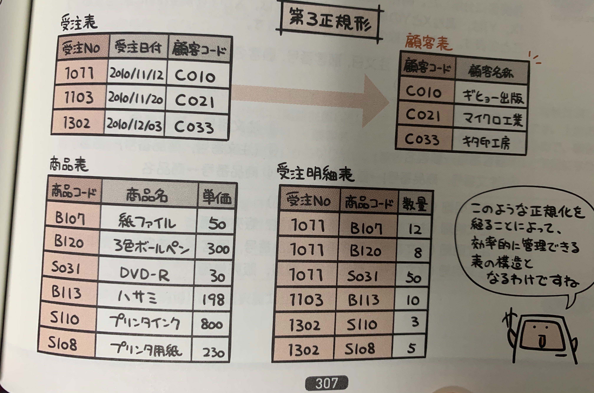

## 正規化とは
データに矛盾や重複が起こらないよう最適化すること。  
表を分割することでデータベースの正規化ができる。

### 具体的には

次の段階をへてデータベースの正規化が行われる。

1. 非正規形
2. 第一正規形
3. 第二正規形
4. 第三正規形

関係データベースでは第三正規形の表を管理する。

以下、図のような3つの帳票を関係データベースで管理したいとする。

## 非正規形

帳票1枚が1つのレコードに相当するとすると、、

## 第1正規形

非正規形の表から繰り返しの部分を取り除き、ひとつの新しいレコードにした形

## 関数従属と部分関数従属

### 関数従属

**関数従属**とは、主キーが決まるとある列の値も決まる関係のこと。
例えば、主キーである「社員番号」がわかると、「名前」「部署」といった列の値も一意に決まる。  
このとき、「名前」「部署」は「社員番号」に**関数従属**の関係にあるといえる。

### 部分関数従属

**部分関数従属**とは、複合キーの一部の値によって一意に列の値が定まる関係。

## 第2正規形

第2正規形は第1正規形から部分従属関数となっている列を切り出したもの。  

この表でいうと「受注日時」、「顧客コード」、「顧客名称」は「受注No」に従属してる(「受注No」が決まると一意に決まる)。

「商品コード」のところも同様。  

これを分割すると、

このようにかける。

## 第3正規形

主キー以外に従属しているところを切り出した形。

例えばここでは「受注表」の「顧客名称」は主キーの「受注No」ではなく「顧客コード」に従属している、

これを分割して、

