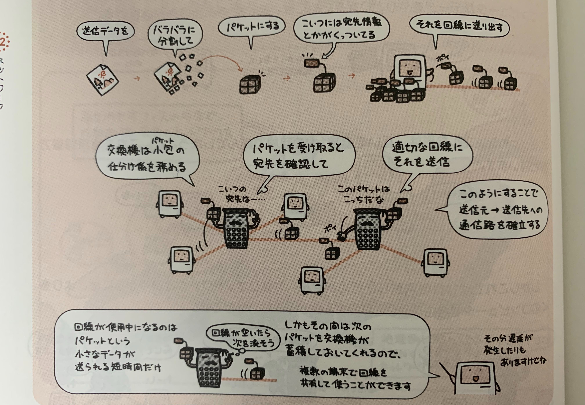

事業所内など局地的な狭い範囲のネットワークを**LAN**  
LAN同士をつなぐ広域のネットワークを**WAN**と呼ぶ

## データを運ぶ通信路の方式

### 専用回線方式

コンピュータがデータをやり取りするためには、お互いを結ぶ通信路が必要。  

最もシンプルなのは、お互いを直接1本の回線で結んでしまうこと。  
これを**専用回線方式**という。

### 交換方式

しかしこれでは、1対1の通信しかできない。  
ネットワークというからには多くのコンピュータと自由にやりとりができないと、、  
そこで、**交換機**を通信の間に挟むことで、  
交換機が回線の選択を行って、必要に応じた通信路が確立される方式を**交換方式**という。

またこの交換方式には大きく分けて2種類ある。

### 回線交換方式

送信元から送信先に至るまでの経路を交換機がつなぎ、通信路として固定してしまう方式。

この方式だと、通信路に選ばれた回線はペアに専有されてしまうので、他の端末がその回線を使うことができない。

アナログ電話などがこのタイプ

### パケット交換方式

パケット(小包の意)という単位に分割された通信データを交換機が適切な回線へと送り出すことで通信路を形成する。

回線が使用中となるのは小さなパケットを送っている短時間だけで、さらにその間、次のパケットを交換機が蓄積しておくので、複数の端末で回線を共有して使うことができる。

しかしその分遅延が発生することもある。
WANの構築以外で現在のコンピュータネットワークで用いられるのは全てパケット交換方式

## WAN通信技術

WANの構築では電気通信事業者の提供する通信サービスを用いて拠点間をつなぐことになる。  
そこで用いられる通信方式として代表的なものは次の通り。

## 専用線

拠点間を専用回路で結ぶサービス。  
回線速度と距離によって費用が決まり、セキュリティは高いが非常に高額。

## フレームリレー方式

パケット交換方式を元に、伝送中の**誤り制御を簡略化して高速化**したもの。  
データの転送単位は可変長のフレームを用いる。

## ATM交換方式(セルリレー方式)

パケット交換方式をもとにデータの転送単位を可変長ではなく、**固定長のセル(53バイト)**とすることで高速化を図ったもの。  
パケット交換方式に比べて、伝送遅延は少ない。

## 広域イーサネット

LANで一般的に使われているイーサネット技術を用いて拠点間を接続するもの。  
高速で、しかも一般的に使用している機器をそのまま使えるためコスト面でのメリットも大きい。  
最近の主流。

## LANの接続形態(トポロジー)

LANを構築するときに、各コンピュータをどのようにつなぐか、その形態のことをトポロジーと呼ぶ。
次の3つが代表的なトポロジー

### スター型

ハブを中心にして放射状に各コンピュータを接続する形態。

### バス型

1本の基幹となるケーブルに各コンピュータを接続する形態。

### リング型

リング状に各コンピュータを接続する形態。

## イーサネット(Ethernet)

LANの規格として現在最も普及しているのが**イーサネット**。
伝達速度に使われている**bps(bits per second)**は1秒間に送ることができるデータ量(ビット数)を表す。  

### バス型の規格

### スター型の規格

## CSMA/CD方式でネットワークを監視する

イーサネットはアクセス制御方式として、**CSMA/CD方式**を採用している。  

CSMA/CD方式では、ネットワーク上の通信状況を監視して、他に送信を行っている者がいない場合に限ってデータを送信する。

もし同時に送信してしまい、通信パケットの**衝突(コリジョン)**が発生しても各々がランダムに求めた時間分待機してから再度送信する。

このように通信を行うことで1本のケーブルを複数のコンピュータで共有することができる。

## トークンリングとトークンパッシング方式

リング型LANの代表格である**トークンリング**ではアクセス制御方式として**トークンパッシング方式**を用いる。

この方式では送信権利を表すとトークンという小さなデータがバケツリレー形式で一方通行で流れている。

通常時はフリートークンがネットワーク上をぐるぐる回っているだけで、  
データを送信したいときは、フリートークンにデータをくっつけて次へ流す。(データのくっついたトークンをビジートークンという)

ビジートークンを受け取ったコンピュータは「自分宛て」じゃない場合はそのまま次へ流し、「自分宛て」の場合はデータを受け取ってから「受け取りましたよ」というマークをつけて再度インターネットに流す。(このトークンもビジートークン)  

マークが付加されたトークンを受け取った送信元に到着すると、送信元はトークンをフリートークンに戻してからネットワークに放流する。

## 無線LAN

ケーブルを必要とせず、電波などを使って無線で通信を行うのが無線LAN。
2.4GHzや5.2GHzなどの周波数帯を使って通信している。

便利な反面、電波を盗聴されてしまう恐れもあるので、通信を暗号化するなどしっかりとしたセキュリティ対策が必要になる。

## クライアントとサーバ

ネットワークにより複数のコンピュータが組み合わさって働く処理の形態はいくつかあるが中でも代表的なのがつぎの2つ。

### 集中処理

ホストコンピュータが集中的に処理をして、ほかのコンピュータはそれにぶらさがっているだけ。

#### メリット
ホストコンピュータに集中して対策ほ施すことで
- データの一貫性を維持・管理しやすい
- セキュリティの確保や運用管理がかんたん

#### デメリット
- システムの拡張が大変
- ホストコンピュータが壊れると全体が止まってしまう。

### 分散処理

複数のコンピュータに負荷を分散させて、それぞれで処理を行うようにした構成。

#### メリット
- システムの拡張がかんたん
- 一部のコンピュータが壊れても全体には影響しない

#### デメリット
- データの一貫性を維持・管理がしづらい
- セキュリティの確保や運用管理が大変

昔は小型のコンピュータがあまりに非力だったので「集中処理」が主流だったが、  
コンピュータの性能があがったことで、分散処理に集中処理のいいところも取り込んだシステム形態が出てきた。

それが**クライアントサーバシステム**

### クライアントサーバシステム

集中的に管理したほうがいい資源(プリンタやハードディスク領域など)やサービス(メールやデータベースなど)を提供する**サーバ**と必要に応じてリクエストを投げる**クライアント**という2種類のコンピュータで処理を行う構成で現在の主流。

- クライアント  
  サービスを要求する側

- サーバ  
  サービスを提供する側

クライアントが「このファイル保存しといて〜」というリクエストを投げて、ファイルサーバが実際にその処理を行う。

ファイルサーバのほかにも以下のような種類のサーバがある。
- ファイルサーバ
  - ファイルを共有したり、保存したりする。
- プリントサーバ
  - プリンタを共有して印刷させてあげたり。
- データベースサーバ
  - データベースへのリクエストを処理する。
- webサーバ
  - webページを公開する。
- メールサーバ
  - 電子メールを受け取ったり送信したり保存したり。

