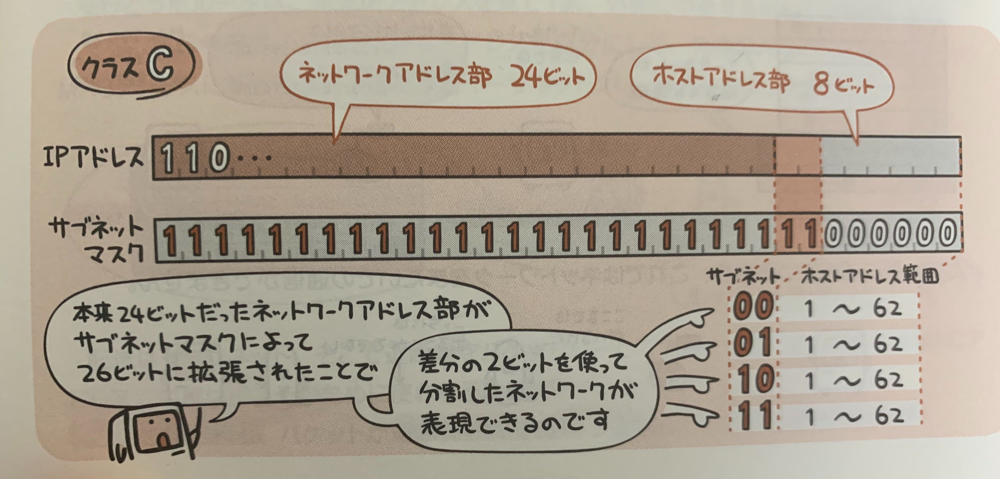
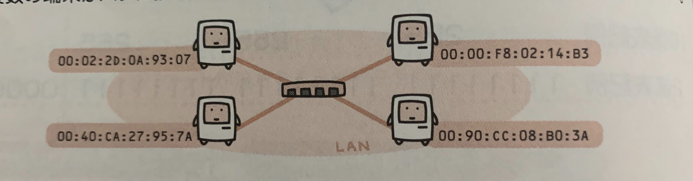
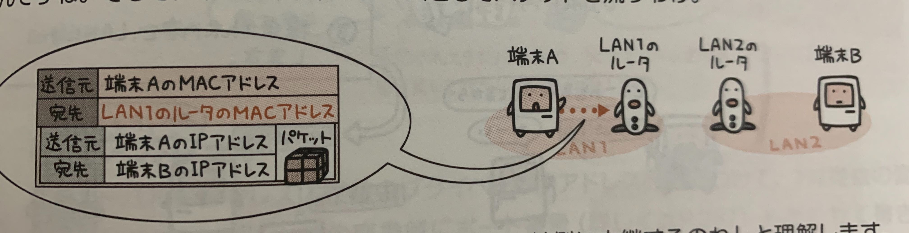
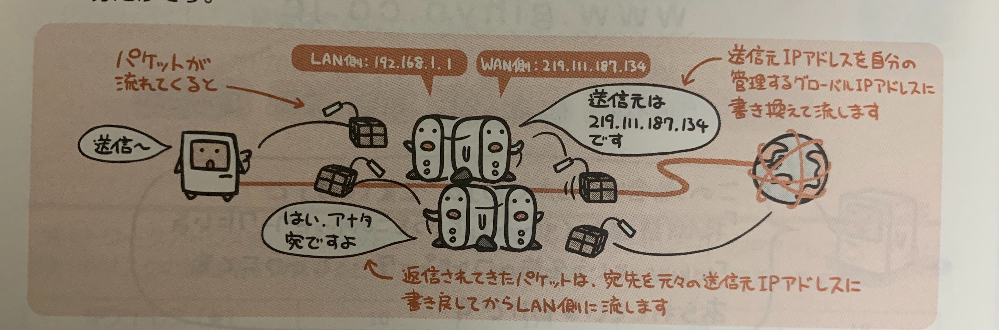
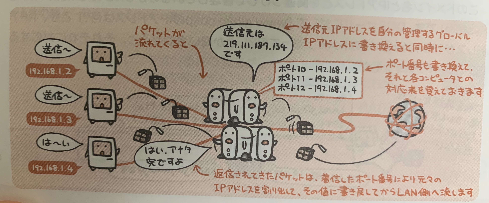

TCP/IPは  
トランスポート層(第4層)の「TCP」とネットワーク層(第3層)の「IP」をセットにした呼び方で、  
この2つのプロトコルの組み合わせがインターネットとデファクトスタンダードとなっている。

それぞれの規定については、  
IPは「複数のネットワークをつないで、その上をパケットが流れるしくみ」と規定されていて、  
TCPは「ネットワーク上で正しくデータが送られたことを保証するしくみ」と規定されている。

この2つを組み合わせることで要は  
「複数のネットワークを渡り歩きながら、パケットを正しく相手に送り届けることができる」という規定になる。

こうしたインターネットの技術をそのまま企業内LANなどに転用したネットワークのことを**イントラネット**という。

## TCP/IPの中核プロトコル

TCP/IPネットワークを構成する上で、中核となるプロトコルが次の3つ。

トランスポート層(第4層)、送信データの信頼性をどのように保証するか
- TCP
- UDP

ネットワーク層(第3層)、ネットワークをいかにしてつなぎ、経路制御するか
- IP

### IP(Internet Protocol)

IPは経路制御をおこない、ネットワークからネットワークへとパケットを運んで、相手に送り届ける。

IPによって構成されるネットワークでは、コンピュータやネットワーク機器を識別するためにIPアドレスという番号を割り当てて管理している。

**コネクションレス型**の通信(事前に送信相手とに接続確認を取ることなく、一方的にパケットをおくりつける)なので、通信品質の保証についてはTCPやUDPなどの上位層に任せている。


### TCP(Transmission Control Protocol)

TCPは通信相手とのコネクションが確立してから、データを送受信する**コネクション型**の通信プロトコル。

パケットにポート番号やシーケンス番号とか(パケットにつける連番)をくっつけて送り、受信側はパケットを受け取ると、「ここまで受け取ったから次はこれよろしくー」と返すことで、到着を保証している。

受信確認をいちいち待ってから次を送るのは時間をロスするのでとりあえず連続して送っておくことで効率アップを図っている。  
確認なしで送信できる最大サイズを**ウィンドウサイズ**という。


### UDP(User Datagram Protocol)

UDPはコネクションレス型の通信プロトコルなので、パケット再送制御を一切行わないため信頼性にかけるが、その分高速。

データの信頼性よりもリアルタイム性を重視する用途に適している。  
具体的には映像配信サービスなど。

## IPアドレスはネットワークの住所

TCP/IPのネットワークで繋がれているコンピュータやネットワーク機器はIPアドレスという番号で管理されている

個々のコンピュータを識別するためのものなので重複はない。

IPアドレスは32ビットの数値で表されるが長いし覚えづらいので、8ビットずつに区切ってそれぞれを10進数で表し「.」でつないで表す。

## グローバルIPにアドレスとプライベートIPアドレス

### グローバルIPアドレス

グローバルIPアドレスはLANの外でやりとりするときに必要なIPアドレスで、  
インターネットの世界で使用するIPアドレスアドレスなので、世界中で一意であることが保証されいないといけず、地域ごとにNIC(Network Infomation Center)が管理しているので、好き勝手に割り当てることができない。

### プライベートIPアドレス

プライベートIPアドレスは、企業内などのLANの中で使えるIPアドレスで、LAN内の重複がなければシステム管理者が自由に割り当てることができる。


プライベートIPアドレスとグローバルIPアドレスの関係は電話の内戦と外線の違いによく似ている。


## IPアドレスは「ネットワーク部」と「ホスト部」から成る

IPアドレスは「コンピュータの住所みたいなもの」だったが、普段のハガキに書く宛名によく似ている。

IPアドレスの内容は、ネットワークごとに分かれる**ネットワークアドレス部**とネットワーク内でコンピュータを識別するための**ホストアドレス部**に分かれる。  
これは宛名が「住所部分と名前部分」で構成されているのと同じ。


## IPアドレスのクラス

IPアドレスは使用するネットワークの規模によって、
クラスA、クラスB、クラスCと3つのクラスに分かれる。  
それぞれ「32ビット中の何ビットをネットワークアドレス部に割り当てるか」が規定されている。

クラスAは、  
大規模ネットワーク用で割り当てるコンピュータの数が多いため、ホスト部を長めにネットワーク部を短めにしている。  
- ホストアドレス部：24ビット
- ネットワークアドレス部：8ビット

クラスBは、  
中規模ネットワーク用で  
- ホストアドレス部：16ビット
- ネットワークアドレス部：16ビット

と規定されている。

クラスCは、  
小規模ネットワーク用で割り当てるコンピュータの数が少ないため、ホスト部を短めにネットワーク部を長めにしている。  
- ホストアドレス部：8ビット
- ネットワークアドレス部：24ビット


ホストアドレス部が「すべて1」「すべて0」のアドレスはそれぞれ「ネットワークアドレス」「ブロードキャストアドレス」という意味で予約されているため使えない


## ブロードキャスト

同一ネットワーク内の全てのホストに同じデータを一斉に送ることを**ブロードキャスト**という。

このときのIPアドレスのホストアドレス部は「すべて1」という形で決まっている。

ブロードキャストは「ネットワーク内全員宛」なのでOSI階層モデル第3層(ネットワーク層)のルータを超えることはない。

ブロードキャストとは反対に特定の1台のみに送ることを**ユニキャスト**という。  
また複数ではあるが不特定多数ではなく、決められた範囲内での複数のホストに送信する場合は**マルチキャスト**という。

## サブネットマスクでネットワークを分割する

一番小規模なクラスCでも254台のホストを扱えるが、「そんなにホスト数はいらないから事業部ごとにネットワークを分けたい」という場合、**サブネットマスク**を用いて、ネットワークを分割することができる。

サブネットマスクは各ビットの値(1がネットワークアドレス、0がホストアドレスを示す)によって、IPアドレスのネットワーク部とホスト部とを再定義することができる。




## MACアドレスとIPアドレスの違い

### ネットワークの流れ

1. 複数の端末がハブに接続されている単一のネットワークをイメージ
  
  このネットワークはイーサネット規格によって構成されている。  
  イーサネットはOSI参照モデルの第1層(物理層)と第2層(データリンク層)をサポートするもので、端末はそれぞれ固有のMACアドレスアドレスを持っている。  
  つまりイーサネットの世界では、送信元と宛名はMACアドレスを用いてパケットの配送を行える。  
  しかし、イーサネットではネットワークをまたいでの通信は行えない。

2. ネットワークをまたいでの通信をするには？
  そこで、OSI参照モデル第3層(ネットワーク層)のIPが必要になってくる。  
  この層ではIPアドレスを用いて端末を識別し、ネットワーク間を中継できるようにする。  
  ネットワークを超えた相手にパケットを送りたい場合、送り元には自分のIPアドレス、宛先には相手のIPアドレスを記載してパケットを送る。

3. 2で端末が送るのは「送信元のIPアドレスと宛先のIPアドレス」を記載したパケットだった。じゃあ誰におくるのか？？
  それは、端末からルータに送られる。  
  つまり、同じネットワーク内のルータ。  
  
  ここでルータは宛先をみて、「ネットワークの外におくるのか」と認識し、  
  送信元を自分の(ルータの)MACアドレスに、  
  宛先を中継先のルータのMACアドレスに書き換えてイーサネットフレームワークといて流す。

  4. これを繰り返して、目的地まで到着。


以上のように、  
近距離をバケツリレーしてつなぐために使われるのはMACアドレス、  
中継はIP、でそのために使われるのがIPアドレス。

## DHCPは自動設定するしくみ

LANにつなぐコンピュータの台数が増えてくると、1台ずつ重複しないIPアドレスの割り振りが大変。

そこを自動化するしくみが**DHCP**というプロトコル。
これを使うことで管理の手間が省け、人為的なミスも防げる。


### 手順

1. 新しくLANに参加したいコンピュータからLAN上のDHCPサーバにリクエストがとぶ。

2. 使われていないIPアドレスと、そのネットワーク内で用いる各種設定内容が提供される

3. 提供された内容でLANに参加できる

## NATとIPマスカレード

LANの中ではプライベートIPアドレスを使っているのが一般的だが外のネットワークと通信するにはグローバルIPアドレスが必要。  
そのためルータはWAN側の外のIPアドレスとLAN内のIPアドレスの2コのIPアドレスを持っていたりする。

では、プライベートIPアドレスしか持っていない各コンピュータは外のコンピュータとどのようにやりとりをするのか。  

そこで使われるのが、NATやIPアドレスマスカレードといったアドレス変換技術。  
これらはルータなどによく実装されている。

### NAT
グローバルIPアドレスとプライベートIPアドレスを1対1で結びつけて、相互に変換を行う。  
同時に接続できるのはグローバルIPアドレスの個数分だけ。



### IPマスカレード(NAPT)

グローバルIPアドレスに複数のプライベートIPアドレスを結びつけて、1対複数の変換を行う。  
IPアドレスの変換時にポート番号も合わせて書き換えることによって、1つのグローバルIPアドレスでも複数のコンピュータが同時にインターネットに接続できる。



## ドメイン名とDNS

覚えづらいIPアドレスに対して、文字で別名をつけたものが**ドメイン名**。

```
ドメイン名の例
www.gihyo.co.jp
```
この例の場合だと、  
「日本(jp)」の「企業(co)」で「技術評論社(gihyo)」というところのネットワークにいる「www」という名前のコンピュータ  
ということを表している。

このドメイン名とIPアドレスの関連付けをおこなっているのが**DNSサーバ**で、  
DNSサーバに対して「このドメイン名のIPアドレスは？」とリクエストを投げると、IPアドレスが帰ってきて、その逆もそう。