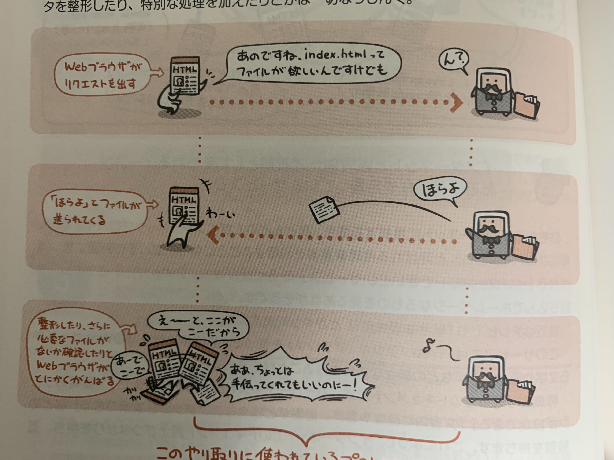
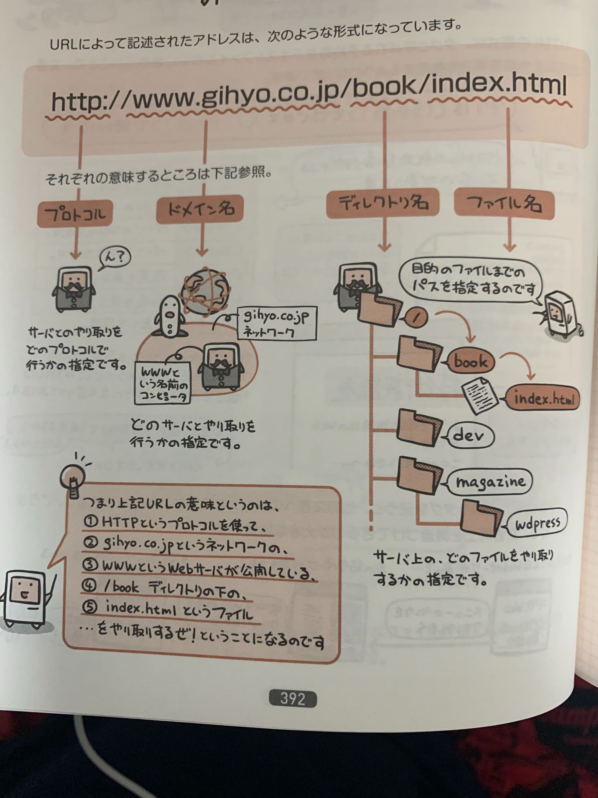

WWW(World Wide Web)はインターネット上で標準に使われているドキュメントシステム。  

散在するドキュメント同士が相互に繋がりをもつのが特徴。

## Webサーバにリクエストを送ってレスポンスを受け取る

WWWのサービスにはWebサーバとWebブラウザ(という名のクライアント)が欠かせないわけだが、  
そのやり取りはとてもシンプル。

Webサーバの仕事はクライアント(Webブラウザ)からきたリクエストにただファイルを渡すだけ。  
特別な処理を加えたりとかは一切しない。

またWebページはHTMLで記述される。

## URLはファイルの場所を示すパス

