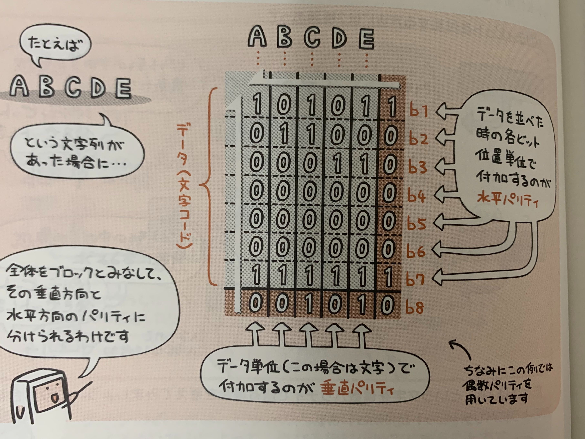

データの誤りとは、ビットの内容が「0→1」、「1→0」とノイズやひずみによって、異なる値に化けてしまうこと。

データは突き詰めていくと結局、「0か1か」だった。  
でもケーブルに流れるのはデータではなく、電気的な信号。  
つまり、信号の波形を「この範囲の波形は0」、「この範囲の波形は1」としている。

このことからも電気的な干渉などで、データの誤りが起こることは容易に想像できるが、  
このデータの誤りを防ぐ手段をみていくと、**パリティチェック**や**CRC(巡回冗長検査)**などの手法がある。

## パリティチェック

パリティチェックでは、送信するビット列に対して、**パリティビット**と呼ばれる検査用のビットを付加することでデータの誤りを検出する方法。

例えば、  
送信したいビット列が「01000001」  
であった場合、  
ビット列の「1の数」が偶数の為、  
パリティビットとして「0」を先頭につける。  
これは「1の数」が奇数のときは、「1」を先頭につける。  

こうすることで、データの誤りを検出できるが、  
**偶数個の誤りは検出できない**し、**どのビットが誤りか**も検出できない。

## 水平垂直パリティチェック

パリティビットは「どの方向に付加するか」によって**水平パリティ**と**垂直パリティ**がある。

### 水平パリティ

データを並べたときの、各ビットの位置単位で付加するのが水平パリティ

### 垂直パリティ

データ単位で付加するのが、垂直バリティ

### 水平垂直パリティの特徴

水平垂直のパリティチェックをおこなうことで、交錯部分に誤りがあると分るので、  
1ビットであれば誤りの位置を特定できる。  
ただし2ビット以上の誤りだと、特定はできない。

## CRC(巡回冗長検査)

CRCではビット列を特定の式(生成多項式と呼ばれる)で割り、その余りをチェック用データとして元のビット列に付加する方法。

送信元が送りたいビット列に対して生成多項式で割った余りを末尾にくっつけることで、  
受信する側は、その生成多項式さえ知っていれば、「余りを末尾にくっつけたビット列」は生成多項式で割り切れるので、  
割り切れたら誤りなし  
割り切れなかったら誤りがある。  
と判断できる。

### CRCの特徴

この方式では、データの誤り訂正はできないが、連続した誤り(バースト誤り)など、複数の誤りを検出できる。
