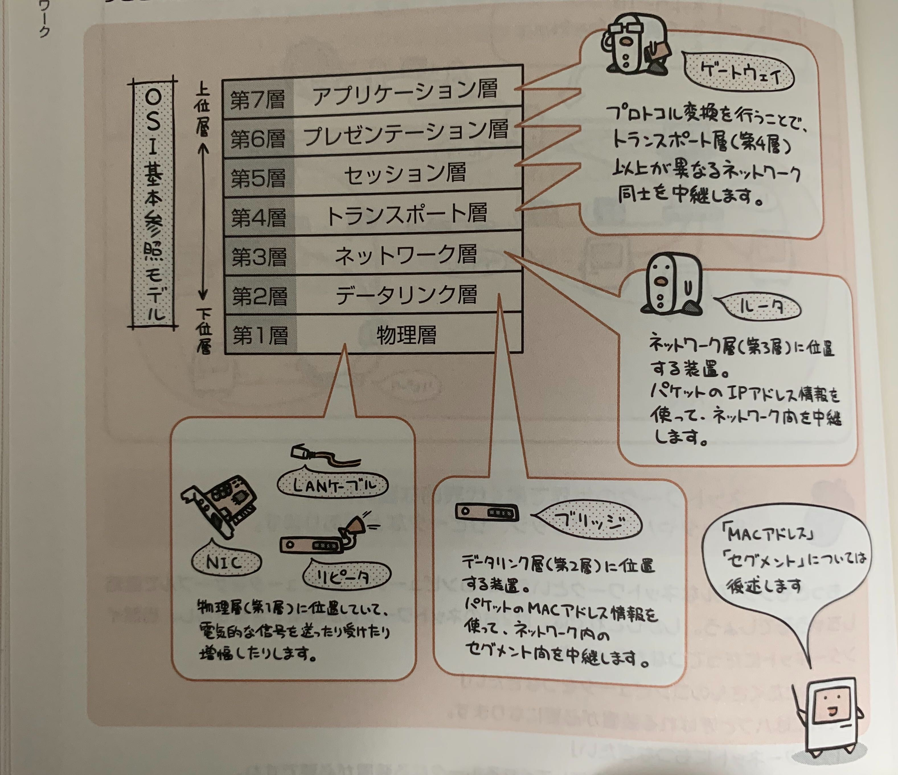
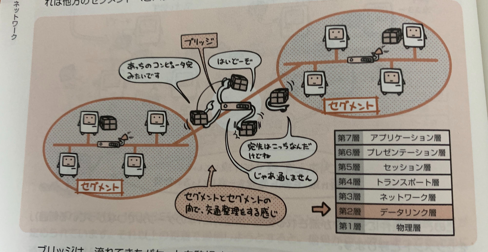
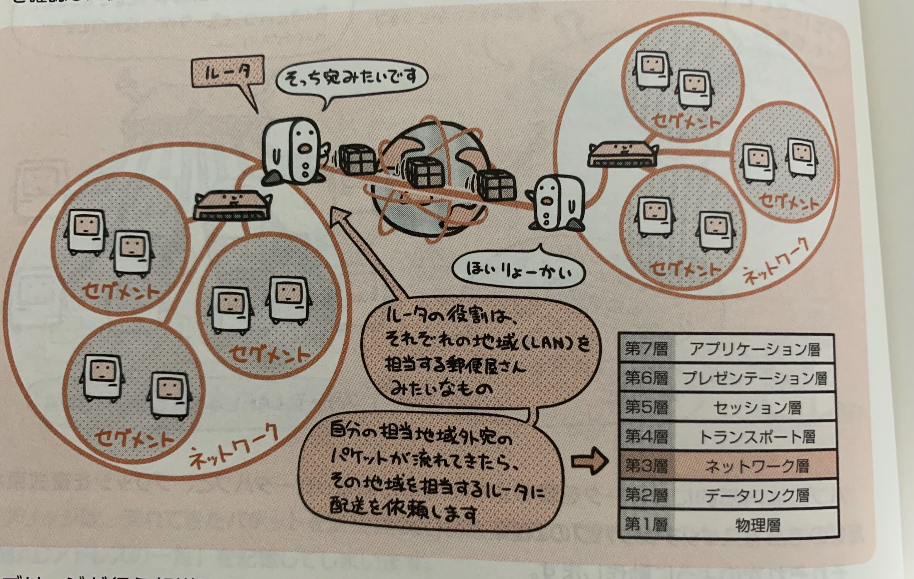
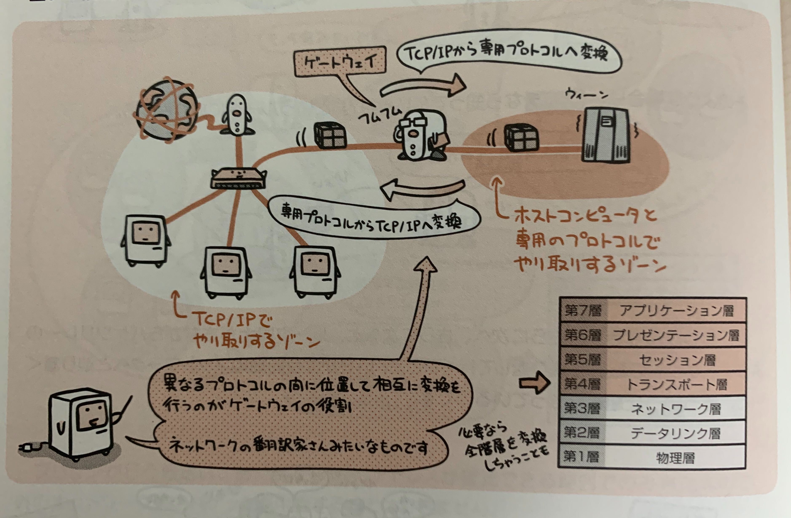

ネットワークの世界で働く代表的な装置には、ルータやハブ、ブリッジ、リピータなどがある。

##  LANの装置とOSI基本参照モデルの関係

- ゲートウェイ  
  プロトコル変換を行うことで、トランスポート層(第4層)以上が異なるネットワーク同士を中継する。

- ルータ  
  ネットワーク層(第3層)に位置する装置。  
  パケットのIPアドレス情報を使って、ネットワーク間を中継する。

- ブリッジ  
  データリンク層(第2層)に位置する装置。  
  パケットのMACアドレス情報を使って、ネットワーク内のセグメント間を中継する。

- LANケーブル、NIC、リピータ  
  物理層(第1層)に位置する装置。  
  電気的な信号を送ったり受けたり増幅させたりする。

## NIC(Network Interface Card)

コンピュータをネットワークに接続するための拡張カードが**NIC**。  
**LANボード**とも呼ばれる。

NICの役割は、データを電気信号に変換してケーブル上に流すこと。そして受け取る事。

## MACアドレス

NICを始めとするネットワーク機器には、製造段階で**MACアドレス**という番号が割り振られている。  
これはIEEEによって管理されている製造メーカー番号と自社製品に割り振る製造番号との組み合わせでできており、世界中で重複しないことが保証されている。

イーサネットではこのMACアドレスを使って各機器を識別する。

## リピータ

リピータは物理層の中継機能を提供する装置。
ケーブルに流れる電気信号を増幅して、LANの総延長距離を伸ばす。

## セグメント

ネットワークに流したパケットは宛先が誰かに依らずにとにかく全員に渡されるが、  
このように「無条件にデータが流れる範囲(論理的に1本のケーブルでつながっている範囲)」のことを**セグメント**という。

ひとつのセグメントに大量にコンピュータが接続されていると、パケットの衝突(コリジョン)が頻繁に発生することとなり、回線の利用効率が下がる。

## ブリッジ

ブリッジはデータリンク層(第2層)の中継機能を提供する装置。  
セグメント間の中継役として、流れてきたパケットのMACアドレス情報を確認、必要であれば他方のセグメントへとパケットを流す。

セグメントとセグメントの交通整理をするイメージ。

ブリッジは流れてきたパケットを監視することで、「それぞれのセグメントに属するMACアドレスの一覧」を記憶する。  
そうすることで、  
以降、その一覧に従ってセグメント間を橋渡しする必要のあるパケットだけを中継する。  
これによって、中継パケットはCSMA/CD方式に従って放出する為、コリジョンの発生が抑えられ、ネットワークの利用効率が上がる。

## ハブ

ハブはLANケーブルの接続口(ポート)を複数もつ集線装置。

ハブには、中にリピータを備えたリピータハブや、  
ブリッジを備えたスイッチングハブがある。

## ルータ

ルータはネットワーク層(第3層)の中継機能を提供する装置。  
異なるネットワーク(LAN)同士の中継役として、流れてきたパケットのIPアドレス情報を確認したあとに、最適な経路にパケットを転送する。  

### ブリッジとルータの違い

ブリッジが行う転送は、あくまでもMACアドレスが確認できる範囲でのみ有効なので、外のネットワーク宛のパケットを中継することはできない。

ルータはパケットに書かれた「宛先IPアドレス」を確認する。  
IPアドレスとは「どのネットワークに属する何番のコンピュータか」という内容を表す情報。  
この宛先IPアドレスと自身の持っている**経路表(ルーティングテーブル)**を付き合わせて最適な転送先を選択する。
これを**経路選択(ルーティング)**と呼ぶ。

## ゲートウェイ

ゲートウェイはトランスポート層(第4層)以上が異なるネットワーク間で、プロトコル変換による中継機能を提供する装置。  
ネットワーク双方で使っているプロトコルの差異をこの装置が変換、吸収することで、お互いの接続を可能とする。

簡単にいうと、  
異なるプロトコル間の間に位置して相互に変換を行うのがゲートウェイの役割。  
ネットワークの翻訳家みたいなもの。

例えば、携帯メールとインターネットの電子メールが相互にやりとりできるのも、間にメールゲートウェイという変換器が入っているおかげ。

またゲートウェイは専用の装置というだけではなく、その役割をもたせたネットワーク内のコンピュータなども該当する。