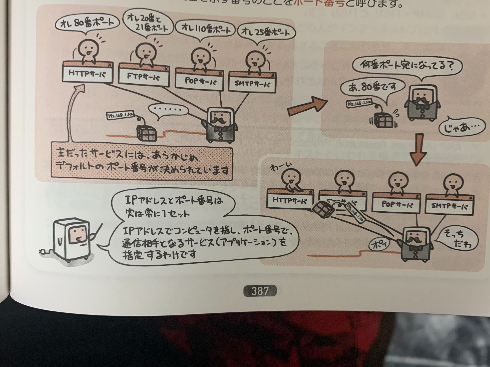

ネットワーク上ではどんなプロトコルがサービスを提供しているのかをみていく。

## 代表的なサービス

代表的なプロトコルは次のようなものがあり、主だったプロトコルにはあらかじめポート番号が予約されており、これをウェルノウンポートという。

### HTTP(HyperText Transfer Protocol)

Webページの転送に使用するプロトコル。  
Webブラウザを使ってHTMLで記述された文書を受信するときなどに使う。

ポート番号は「80」

### FTP(Flie Transfer Protocol)

ファイル転送サービスに使用するプロトコル。  
インターネット上のサーバにファイルをアップロードしたり、サーバからファイルをダウンロードするときに使う。

ポート番号は制御用「20」、転送用「21」

### Telnet

他のコンピュータにログインして遠隔操作を行う際に使うプロトコル。

ポート番号は「23」

### SMTP(Simple Mail Transfer Protocol)  
電子メールの配送部分を担当するプロトコル。  
メールの送信時や、メールのサーバ間での送受信時に使う。

ポート番号は「24」

### POP(Post Office Protocol)
電子メールの受信部分を担当するプロトコル。  
メールサーバ上にあるメールボックスから受信メールを取り出すために使う。

ポート番号は「110」  

### NTP(Network Time Protocol)
コンピュータの時刻合わせに使うプロトコル。  

ポート番号は「123」

## サービスはポート番号で識別する

ネットワーク上で動くサービスたちは個々に「それ専用のサーバマシンを用意しないといけない」  
というわけではない。

サーバというのは「プロトコルを処理してサービスを提供するためのプログラム」が動くことでサーバになっているので、  
ひとつのコンピュータが様々なサーバを兼任することが当たり前。

でも、IPアドレスだと、パケットの宛先は識別できても、そのサーバプログラムに宛てたものなのかは判断できない。

そこで、プログラム側では、0〜65、535までの範囲で自分専用の接続口を設けて待つようになっていて、その接続口を示す番号が**ポート番号**。

実は、IPアドレスとポート番号はセットで、IPアドレスでコンピュータを指し、ポート番号で通信相手となるサービスをしてする。

