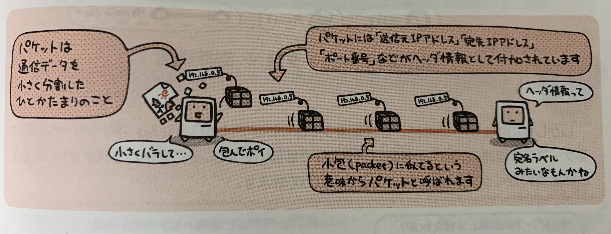

## プロトコルとOSI基本参照モデル

ネットワークを通じてコンピュータ同士がする約束事。  
それを**プロトコル**という。

プロトコルには様々な種類があり、「どんなケーブルを使って」「どんな形式で」といったことが事細かに決まっている。  
それらを7階層に分けたものが**OSI基本参照モデル**。  
基本的にはこの第1階層から第7階層までの全てを組み合わせることでコンピュータ同士のコミュニケーションが成り立つようになる。


- 第7層: アプリケーション層
  - 具体的にどんなサービスを提供するか
- 第6層: プレゼンテーション層
  - データはどんな形式にするか
- 第5層: セッション層
  - 通信の開始から終了までをどう管理するか
- 第4層: トランスポート層
  - 通信の信頼せをどう確保するか
- 第3層: ネットワーク層
  - ネットワークとネットワークをどう中継するか
- 第2層: データリンク層
  - 同一ネットワーク内でどう通信するか
- 第1層: 物理層
  - 物理的にどうつなぐか

例えばLANケーブルの規定なんかは第1層の話。


現在はインターネットの世界で標準とされていることから「TCP/IP」というプロトコルが広く利用されている。


## なぜ「パケット」に分けるのか

TCP/IPというプロトコルを使うネットワークでは通信データをパケットに分割して通信路へ流す。



なぜ分割して流さないといけないのかというと、  
通信路上に流せるデータは有限だから。

## ネットワークの伝達速度

ネットワークの伝送に要する時間は
```
伝送時間[s] = データ量[bits] ÷ 回線速度[Mbits/s]
```

で求まる。

が実際の実効値が理論値通りになるわけではなく、  
**実効速度**、  
**伝送効率**、
などを用いる。

