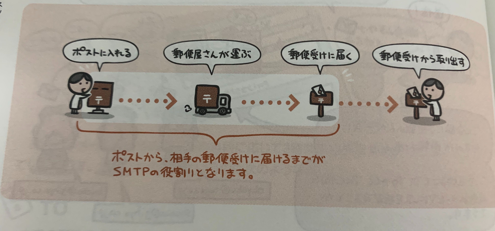
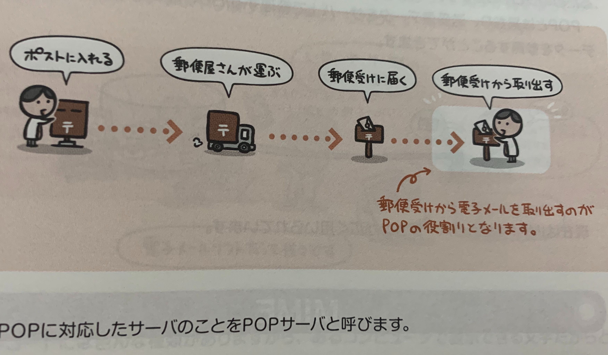

電子メールは手紙のコンピュータネットワーク版。  
メールアドレスを使ってやり取りをする。

電子メールではネットワーク上のメールサーバをポスト兼私書箱のようにみたててテキストや各種ファイルをやりとりする。  
昔はテキスト情報しかやり取りができなかったが、**MIME**という規格の登場でいろんなファイル形式が扱えるようになった。

## メールアドレス

メールアドレス
```
ユーザ名@ドメイン名
naoya@dip.co.jp
```

上記のようにメールアドレスにはドメイン名とユーザ名が含まれる。  
ドメイン名で、どのメールサーバに届ければよいのかが決まり、  
ユーザ名で、そのメールサーバが管理している該当ユーザを探す。  
よって、メールサーバ内で、ユーザ名を重複することはできない。

## 電子メールを送信するSプロトコル(SMTP)

電子メールの送信にはSMTPというプロトコルを使用する。



SMTPに対応したサーバをSMTPサーバといい、  
SMTPサーバの仕事は次の2つ。

- 電子メールソフトから送信されたメール本文を受け取る。

- 宛先に書かれたメールアドレスを見て、送り先のメールサーバへとメールを配送する。  
配送されたメールは、該当するメールボックスに保存される。


## 電子メールを受信するプロトコル(POP)

メールを受信するにはPOPというプロトコルを使用する。



POPに対応したサーバをPOPサーバといい、  
POPサーバはPOPクライアントから「受信メールをください」というリクエストが来ると、  
メールボックスから受信済みのメールを取り出して配送する。

現在は「POP Version3」を表す**POP3**が広く使われている。

## 電子メールを受信するプロトコル(IMAP)

POPとは異なり、送受信データをサーバ上で管理するため、どのコンピュータからも同じデータを参照することができる。

## MIME

電子メールでは、本来ASCII文字しか扱うことができない。  
そこで日本語などの2バイト文字や画像データなどファイル添付を行えるようにする拡張規格が**MIME**。