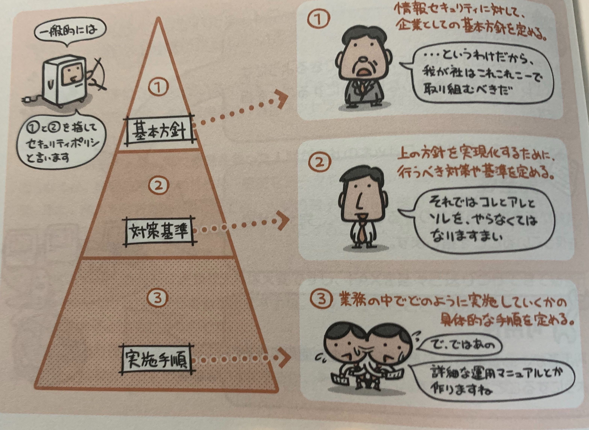

## セキュリティマネジメントの3要素

「安全最優先」だと、ネットワークの利便性を捨てることになってしまう。  
「安全性」と「利便性」をどこでバランスさせるか。  
というのがセキュリティマネジメントの基本的な考え方。

つまり、情報セキュリティは、次の3つの要素を管理してうまくバランスさせる事が大切。

- 機密性
  - 許可された人のみが情報を閲覧できるようにして、情報が漏洩しないようにすることを指す。
- 完全性
  - 情報が書き換えられたりすることなく完全な状態を保っていることを指す
- 可用性
  - 利用者が、必要なときに必要な情報資産を使用できるようにすること

## セキュリティポリシ

情報セキュリティを社内で決めただけでは何も反映されない。  

企業として、どのように取り組むかを明文化して、社内に周知・徹底する必要がある。  
これを**セキュリティポリシ**という

セキュリティポリシは基本方針と、対策基準、実施手順の3階層で構成されている。

## 個人情報保護法とプライバシーマーク

個人情報保護法とは、  
「氏名、電話番号、家族構成、…」などなどの個人情報を事業者が適切に扱うためのルールを定めたもの。  
消費者が被る不利益を未然に防ぐための法律。

個人情報に関する認定制度として、プライバシーマーク制度がある。  
プライバシーマーク制度の認定を受けた事業者は、そのことを示すマークを企業Webサイトや名刺などに表示することが許される。