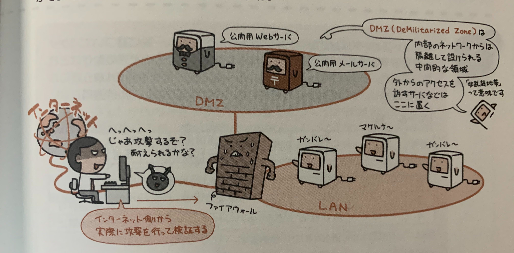

## ファイアウォール

LANの中と外を区切る壁として登場するのが**ファイアウォール**。
インターネットのような外のネットワークとLANとの間に立つ「壁」として、外からの不正アクセスを防いてくれる。

ファイアウォールとは機能的な役割のことなので、特に定まった形はない。
重な実現方法としては、  
**パケットフィルタリング**や、**アプリケーションゲートウェイ**などがある。

## パケットフィルタリング

パケットフィルタリングは名の通り、パケットを無条件で通過させるのではなく、あらかじめ指定されたルールにのっとって通過させるか否かを制御する機能。

この機能ではパケットのヘッダ情報(送信元のIPアドレスや宛先IPアドレスアドレス、プロトコル種別、ポート番号)をみて通過の可否を判定する。

## アプリケーションゲートウェイ

アプリケーションゲートウェイはLANの中と外の間に位置していて、外部とのやり取りを代行して行う**プロキシサーバー**(代理サーバ)とも呼ばれる。

プロキシサーバーはリクエストを受けると、代わりに相手のサーバとやり取りを行って、取得結果をクライアントにわたす。

外のコンピュータからはプロキシサーバしか見えないので、LAN内のコンピュータが不正アクセスの標的となることを防ぐ。

アプリケーションゲートウェイ型のファイアウォールは**WAF(Web Application Firewall)**があり、  
これはWebアプリケーションに対する外部からのアクセスを監視するもので、パケットフィルタリング型のファイアウォールが、ヘッダ情報を参照して通過の可否を判定するのに対して、WAFは通信データの中身までチェックすることで悪意を持った攻撃を検知する。

## ペネトレーションテスト

既知の手法を用いて実際に攻撃を行い、それによって脆弱性の有無を確認するテスト。

**DMZ**とは、「非武装地帯」の意味で、内部のネットワークから隔離して設けられる中間てきな領域。  
公開用webサーバ、公開用メールサーバなどが置かれる。

このテストの第一の目的は「ファイアウォールや公開サーバに対して侵入できないことを確認する」こと。  
しかし、もし突破されたらどうなるのか？、どこまで突破されるのか、何をされてしまうのか、といった視点での検証にこのテストの特徴がある。
