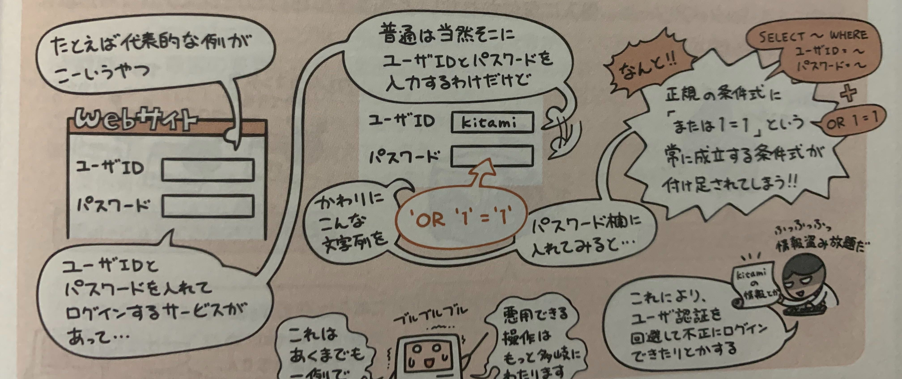
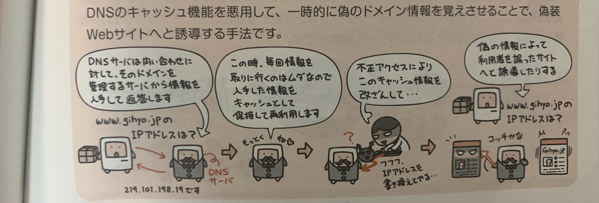
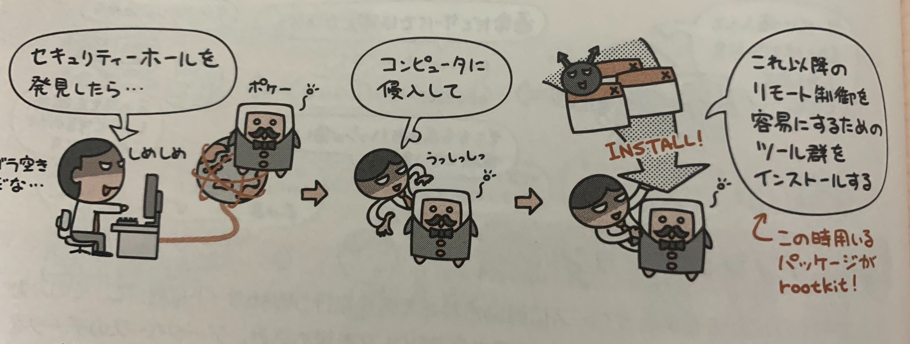

一番はじめに「あなた誰？」と確認する行為を**ユーザ認証**という。

ユーザ認証をパスして、システムを利用可能状態にすることを**ログイン**、  
システムの利用を終了して、ログイン状態を打ち切ることを**ログアウト**という。

## ユーザ認証の手法

### ユーザIDとパスワードによる認証

ユーザIDとパスワードを使って、個人を識別する認証方法。  
基本的にユーザIDは隠されていない情報なので、  
パスワードを漏洩しないように、その扱いには十分に気をつける。

- 推測しやすいパスワードを使わない
- 付箋やメモ用などにかいて人目のつく場所に置かない
- 定期的なパスワードの変更を心がけ、ずっと同じパスワードにしない

### バイオメトリクス認証

指紋や声紋、虹彩(眼球内の薄膜)などの身体的特徴を使って個人を識別する認証方法。  
生体認証とも呼ばれる。

### ワンタイムパスワード

一度限り有効という使い捨てのパスワードを用いる認証方法。  
トークンと呼ばれる、ワンタイムパスワード生成器を使うのが一般的。

### コールバック

遠隔地からサーバーへ接続する場合などに、一旦アクセスした後に回線を切り、  
逆にサーバ側からコールバック(着信側から再発信)させることでアクセス権を確認する方法。

## アクセス権の設定

社内で共有している書類を、「許可された人だけが閲覧できるようにする」というように設定できるのが**アクセス権**。  

アクセス権には「読み取り」「修正」「追加」「削除」などがある。

## ソーシャルエンジニアリング

コンピュータシステムとは関係ないところで、人の心理的不注意をついて情報資産を盗み出す行為。

例としては、  
- ショルダーハッキング
  - 肩越しにパスワードを盗み見る
- スキャビング
  - ゴミ箱を漁って有用な情報を盗み出す

## 様々な不正アクセス手法

### パスワードリスト攻撃
どこからか入手したIDと・パスワードのリストを用いて、他のサイトへのログインを試みる手法。

### ブルートフォース攻撃
特定のIDに対して、パスワードとして使える文字の組み合わせを片っ端から全て試す攻撃。  
総当り攻撃ともいう。

### リバースブルートフォース攻撃
ブルートフォース攻撃とは逆で、よく使われるパスワードを固定しておいて、IDとして使われる文字の組み合わせを片っ端から全て試す手法。

### レインボー攻撃

ハッシュ値から元のパスワード文字列を解析する手法。  
パスワードになりうる文字列とハッシュ値との組をテーブル化しておき、入手した値から元の文字列を推測する。

### SQLインジェクション

ユーザの入力値をデータベースに問い合わせて処理を行うWebサイトに対して、  
その入力内容に悪意ある問い合わせや操作を行うSQL文を差し込み、データベースのデータを不正に取得したり改ざんしたりする手法。

### DNSキャッシュポイズニング

DNSのキャッシュ機能を悪用して、一時的に偽のドメイン情報を覚えさせることで、偽装Webサイトへと誘導する手法。

## rootkit(ルートキット)

不正アクセスに成功したコンピュータに潜伏し、攻撃者がそのコンピュータをリモート制御できるようにするソフトウェアの集合体を**rootkit(ルートキット)**という。

