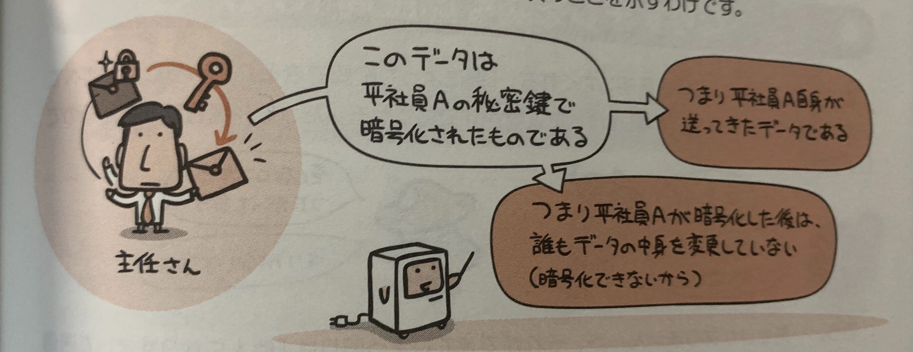
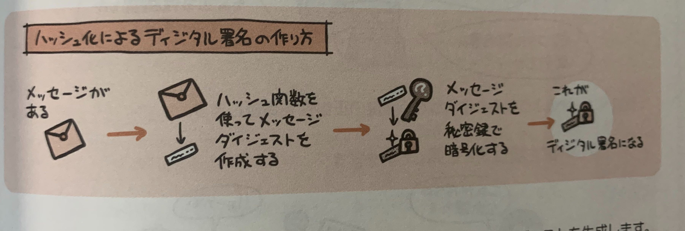
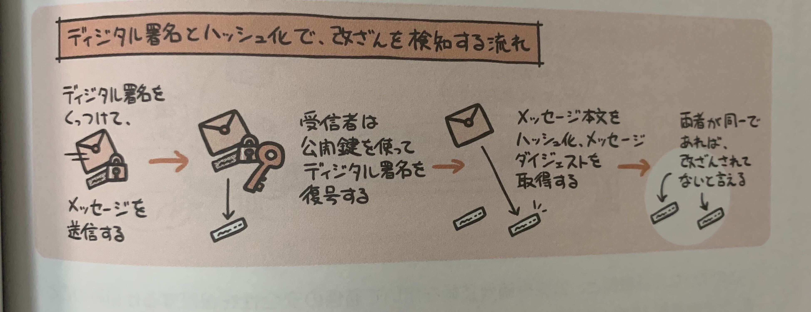
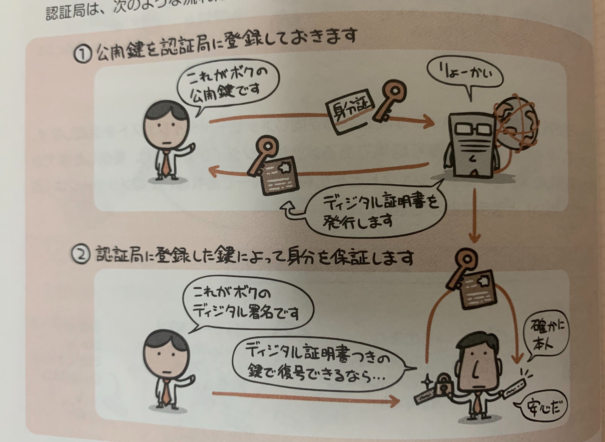

## 盗聴、改ざん、なりすましの危険

メールを例に見てみると、、

### 盗聴
宛先の人以外にも読まれちゃっている

### 改ざん
間で内容が勝手に書き換えられている

### なりすまし
自分になりすまして勝手に誰かが送っている

## 暗号化と復号

通信経路は危険がいっぱいあるということがわかったが、  
どのように対策するのか。

そこで考えられたのが、やり取りする当事者同士だけがわかるようにメッセージを変換すること。  
これを**暗号化**という。
また暗号化されたメッセージを元に戻す作業を**復号**という。

## 盗聴を防ぐ暗号化(共通鍵暗号方式)

当事者同士がたとえば「メッセージを一文字ずつずらす」というような暗号化や復号を行うために使う情報(データ)を**鍵**と呼ぶ。

そして送り手と受け取り手が同じ鍵を用いる暗号化方式を、  
**共通鍵暗号方式**、秘密鍵暗号方式と呼ばれる。

## 盗聴を防ぐ暗号化(公開鍵暗号方式)

共通鍵暗号方式は「お互いに鍵を共有する」というのが前提なので、通信相手の人数分の鍵をもって置かなくちゃいけない。  
さらにインターネットのような不特定多数の相手を対象に通信するのは無理がある。

そこで、**公開鍵方式**がある。  
大きな特徴は、「一般に広くばらまいてしまう」**公開鍵**があるということ。  
この方式では暗号化に使う鍵と、復号のときに使う鍵が別物という特徴がある。

公開鍵で暗号化されたデータはそれとペアになる秘密鍵でしか復号することができない。

## 改ざんを防ぐディジタル署名

公開鍵暗号方式を用いる事で、「途中で改ざんされていないか」「だれが送信したものか」を確認できるようにしたのが**ディジタル署名**

公開鍵暗号方式では、公開鍵で暗号化を行い、それとペアとなる秘密鍵でしか復号できないというものだったが、  
逆でも同じで、秘密鍵で暗号化を行ったらペアの秘密鍵でしか復号できない。

さらに、メッセージ内容を**ハッシュ化**という手法でメッセージ全体から短い要約データ(**メッセージダイジェスト**)を作成し、それを暗号化することでそれをディジタル署名とする。

元データが同じであれば必ず同じメッセージダイジェストになるので、  
ディジタル署名を復号したメッセージダイジェストと、受信した本文から新たに取得したメッセージダイジェストが同じであるかを比較することで、「改ざんが行われていないか」を判定できる。

## なりすましを防ぐ認証局(CA)

「この公開鍵はたしかに本人のものですよ」と証明がないと、「なりすまし」の可能性がある。  
これを証明する機構が**認証局(CA)**

認証局は次のような流れで認証を行う。

このように認証機関と公開鍵暗号技術を用いて通信の安全性を保証するしくみの事を、  
**公開鍵基盤(PKI：Public Key Infrastructure)**という。